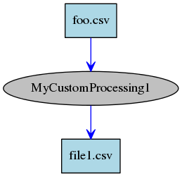

# yagdspy
Yet another graph dependency system 

This is a python module that implements the graph dependency checks that tools like __Make__ use.  Think of it as a simple verion of Airflow or Luigi.

Here's an example of how to use it:

```python
    import yagdspy as gds

    class MyOwnServices():
          pass
    
    def my_custom_processing_step(output_file=None, input_file=None, base=None, config=None):
        pass

    MyCustomProcessing1 = gds.create_processing_module(my_custom_processing_step, name='MyCustomProcessing1', files=
                                          { 'out output_file':'{OUTPUT_DIR}/file1.csv',
                                            'in input_file':'{OUTPUT_DIR}/foo.csv' })

    base = MyOwnServices()  # object to provide services needed by the processing functions, like logging. Not provided by yagdspy
    config = { 'OUTPUT_DIR': '/full/path/to/my/output/dir' }
    L = [ MyCustomProcessing1(base, config) ]

    gds.make_it_go(L, output_graph='/path/to/my/output.png', dry_run=False)
```

This will produce a dependancy graph image showing the links that
yagdspy knows about.  



Running the graph with `make_it_go()` will
invoking each processing module in order by dependencies.  It will first check that
the source files exist already. After each step it will check that the
outputs were created.  If some of the files already exist, it will
check that the outputs have a timestamp after the inputs. If so, it
assume that processing step can be skipped.
